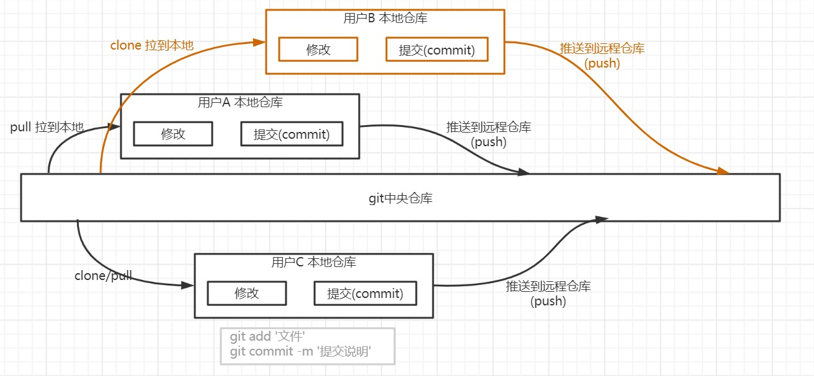
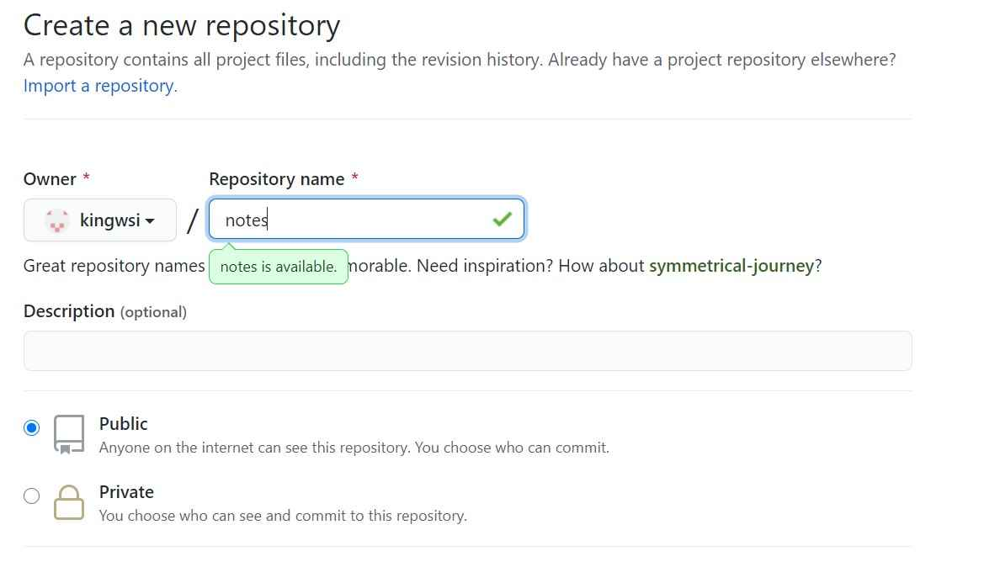
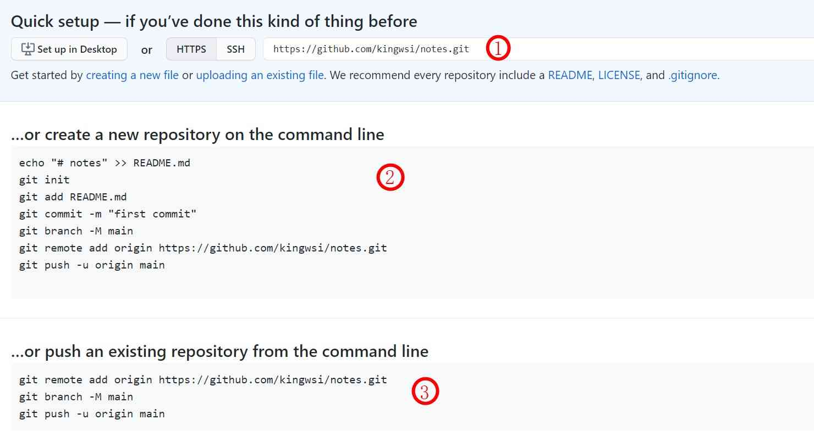

## GIT&Github

- GIT： [git](https://git-scm.com/) 是一个常用的分布式版本控制工具，简单说就是能记录历史修改记录，并且可以回退到任意的版本。git还适用于团队协作，由多人共同开发某项目，提交(commit)并推送(push)到中央仓库(Github)
##### 如图

- Github：就是上面说的git中央仓库，git本身是一个分布式的，每个参与者都会在其本地存储一份，但是仅仅在本地，别人就无法看到，于是就要推送到远程的中央仓库，Github就扮演了远程中央仓库的角色，Github只是个平台，同样的还有[Gitee](https://gitee.com/)，或者是自己搭建开源的[Gitlab](https://gitlab.com/gitlib)
## 使用
##### 创建新仓库

##### 创建完成后显示的信息 

>1.仓库地址

>2.作为一个全新仓库使用，也就是说本地还没有这个仓库，此时需要使用[git clone 仓库地址]来将项目克隆到本地，然后进行开发，或者可以在本地直接使用[git init]初始化项目，然后推送到远程分支。

>3.本地已经存在某个项目了，想把本地的已有项目推送到远程仓库

注意:push操作可能需要输入GitHub账号密码，输入时密码不会显示